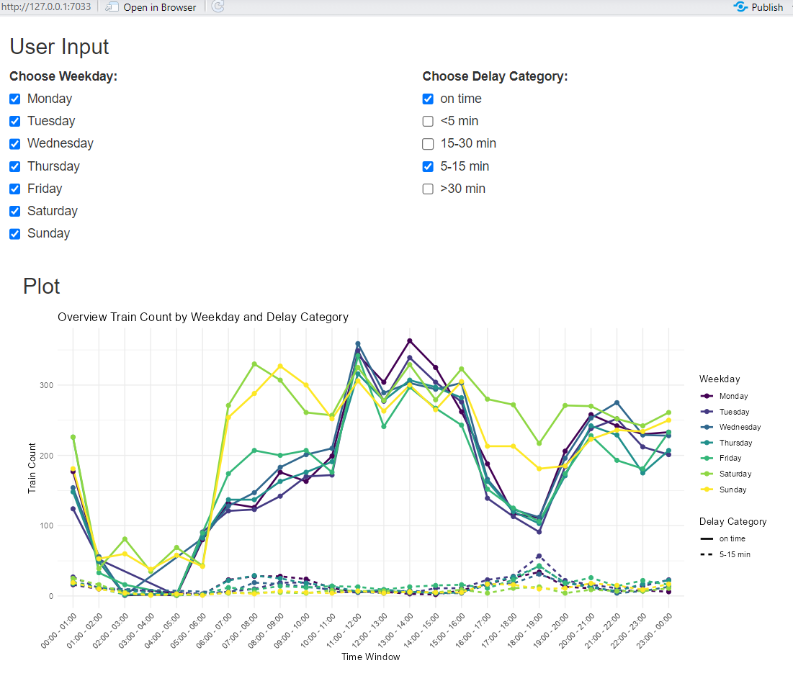
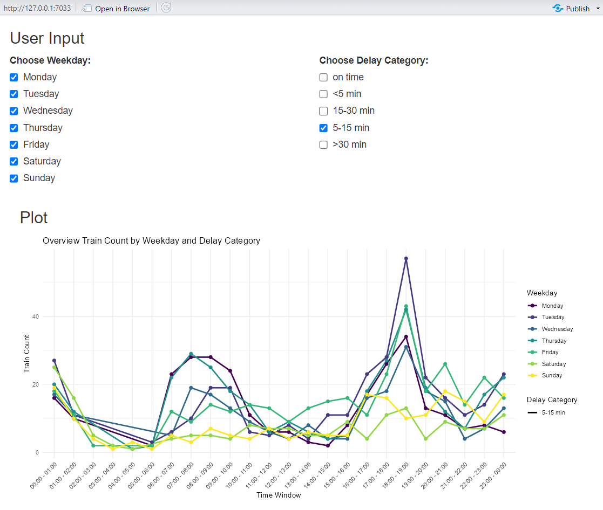

```{r, echo=FALSE , include=FALSE}
## we remove the printing of the hashes in front of all results
library(knitr)
library(details)
opts_chunk$set(echo = FALSE ,
               include = FALSE,
               comment = NA,
               eval = TRUE,
               message = FALSE,
               warning = FALSE)
```

# Introduction

MadeUpCompany AG has recently identified that production employees frequently arrive late to work due to delays in public transportation. This poses a significant challenge since the absence of a single team member can halt the entire production line.

To address this issue, the Production Manager has initiated a research project in collaboration with HSLU.

Three possible countermeasure were identified:

-   Adjust shift start times based on transportation reliability.
-   Implement seasonal adjustments to production capacity based on weather-related transportation disruptions.
-   Consider train categories to mitigate dependency on unreliable train routes.
-   Use weather data and forecasts to predict possible delays

The goal of the Data Science students is to provide MadeUpCompany AG with an insightful report, analyzing publicly available data, to see which of the countermeasures could be most effective.

# Exploring Data

The first step in addressing the research question was to define the project scope and select suitable datasets. The analysis focuses specifically on public transport data for trains arriving in Lucerne, as MadeUpCompany AG is based there. Data from 2024 onward serves as the foundation for more advanced analysis. Additionally, weather data should reflect average Swiss values as a daily baseline.

For this study, data was sourced from [opentransportdata.swiss](https://opentransportdata.swiss/de/ist-daten-archiv/) and the [Schweizer Klimamessnetz](https://www.meteoschweiz.admin.ch/wetter/messsysteme/bodenstationen/schweizer-klimamessnetz.html).

## Tranport Data

[opentransportdata.swiss](https://opentransportdata.swiss/de/ist-daten-archiv/) provides a structured dataset of the public transport in Switzerland.

-   Every month is provided as \*.zip-File
-   Every day is provided as \*.csv-File
-   Every row contains the arrival or departure of a public vehicle

<h3 id="reduceDataset">

Reduce dataset

</h3>

The whole dataset for the year 2024 is roughly \~150GB. Working with such a big data set in R is very time consuming and impractical. Therefore the dataset was reduce to a manageable size before working with R.

The filtering process below reduces the size of the final csv-File to only \~26MB which is way easier to handle than \~150GB.

| Step |                                                            Command                                                             |                       Description                        |
|:----------------------:|:----------------------:|:----------------------:|
|  1   |    [bash download_zip_files.sh](https://github.com/paACode/preprocessing_opentransportdata/blob/main/download_zip_files.sh)    |      Downloads all \*.zip files from the year 2024       |
|  2   | [bash extract_luzern_to_csv.sh](https://github.com/paACode/preprocessing_opentransportdata/blob/main/extract_luzern_to_csv.sh) | Filters for "trains" of "SBB" with destination "Lucerne" |

In the end the colnames needed to be added again as they got lost during filtering.

<details>

<summary>Click to see Shell command</summary>

```         
sed -i "1i BETRIEBSTAG;FAHRT_BEZEICHNER;BETREIBER_ID;BETREIBER_ABK;BETREIBER_NAME;PRODUKT_ID;LINIEN_ID;LINIEN_TEXT;UMLAUF_ID;VERKEHRSMITTEL_TEXT;ZUSATZFAHRT_TF;FAELLT_AUS_TF;BPUIC;HALTESTELLEN_NAME;ANKUNFTSZEIT;AN_PROGNOSE;AN_PROGNOSE_STATUS;ABFAHRTSZEIT;AB_PROGNOSE;AB_PROGNOSE_STATUS;DURCHFAHRT_TF" luzern_arrrivals_only.csv
```

</details>

<p>

### Data Preparation

The size reduction of the dataset described in Chapter <a href="#reduceDataset">Reduce Dataset</a> enabled the data to be imported into R. After importing the data in R, the preprocessing steps of the shell scripts could easily be validated with a simple unit test.

```{r Import}
#import libraries
library(testthat)
library(dplyr)
library(ggplot2)
#general settings
Sys.setenv(LANG = "en")
#
d.train.raw <-  read.csv(file = "raw_transport_2024.csv", sep = ";")
```

```{r Validate, include=TRUE, echo=TRUE}
test_that("Shell Scripts to reduce dataset worked?", {
  expect_equal(unique(d.train.raw$BETREIBER_ABK), "SBB")
  expect_equal(unique(d.train.raw$HALTESTELLEN_NAME), "Luzern")
  expect_equal(unique(d.train.raw$PRODUKT_ID), "Zug")
})
```

Upon reviewing the dataset, we identified several issues that need to be addressed:

-   Trains departing late from Lucerne should be excluded, as only the arrival times are relevant to our analysis.
-   Arrival times that are predicted rather than measured should also be removed, as we are focusing exclusively on real data.

```{r Clean Up}
# Columns needed: 
# More Information: https://opentransportdata.swiss/de/cookbook/actual-data/
# "BETRIEBSTAG" : categorizing weekday/month/season, merging weather 
# "LINIEN_TEXT" :describing the train category IC, S1 , IR16
# "ANKUNFTSZEIT" : calculation of delay
# "AN_PROGNOSE" : calculation of delay

col.needed <-  c("BETRIEBSTAG",
                 "LINIEN_TEXT",
                 "ANKUNFTSZEIT",
                 "AN_PROGNOSE")

```

```{r Data removal, include= TRUE, echo = TRUE}
#Filter 
d.train.filtered <-  d.train.raw %>%
  filter(ANKUNFTSZEIT != "") %>% #Remove trains starting from lucerne
  filter(AN_PROGNOSE != "") %>% #Remove trains where delay calc. not possible
  filter(AN_PROGNOSE_STATUS == "REAL") %>%  #Only consider REAL arrival times
  select(all_of(col.needed)) 

```

Next, the dataset has been edited by adding the delay, which needed to be calculated. Initially, the delay calculation failed as expected, mainly due to the time wrapping at 24:00, resulting in inaccurately high delay values. To address this, the time format was converted to POSIXct, and the difftime function was used to properly compute the delays.

```{r Calculate Delay Function, include=TRUE, echo=TRUE}

calc.delay.s <- function(exp.time,
                         exp.time.format,
                         actual.time,
                         actual.time.format) {
  test_that("Correct Function inputs?", {
    expect_equal(length(exp.time), length(actual.time))
    expect_equal(
      class(exp.time.format),
      class(actual.time.format),
      class(exp.time),
      class(actual.time),
      "character"
    )
  })
  
  actual.time_ <- as.POSIXct(actual.time, format = actual.time.format)
  exp.time_ <- as.POSIXct(exp.time, format = exp.time.format)
  delay.s <- as.numeric(difftime(actual.time_, exp.time_))
  return(delay.s)
  
}
```

The final step involved adding additional categorical data to simplify the analysis. This included variables such as season, month, and weekday, which were converted into ordered factors.

```{r Complement dataset}
#Create dataset with complimentary information
d.train.compl <-  d.train.filtered

#Add delay in seconds
d.train.compl$delay.calc.s <- calc.delay.s(
  exp.time = d.train.filtered$ANKUNFTSZEIT,
  exp.time.format = "%d.%m.%Y %H:%M",# SBB provides min accuracy
  actual.time = d.train.filtered$AN_PROGNOSE,
  actual.time.format = "%d.%m.%Y %H:%M:%S" # Meas. accuracy is in seconds
)
#Add delay in minutes
d.train.compl$delay.calc.min <- round(d.train.compl$delay.calc.s/60, 3)

#Add delay category
d.train.compl$delay.category <- cut(
  x = d.train.compl$delay.calc.s,
  breaks = c(-Inf, 0, 5, 15, 30, Inf) * 60,# because it is in seconds
  labels = c("on time", "<5 min", "5-15 min", "15-30 min", ">30 min")
)

#Add Weekdays
weekday.order <- c("Monday",
                   "Tuesday",
                   "Wednesday",
                   "Thursday",
                   "Friday",
                   "Saturday",
                   "Sunday") 
weekday <- weekdays(as.Date(d.train.compl$BETRIEBSTAG, format = "%d.%m.%Y"))
d.train.compl$weekday <- factor(weekday, levels = weekday.order, ordered = TRUE)

#Add months
month.order <- c(
  "January",
  "February",
  "March",
  "April",
  "May",
  "June",
  "July",
  "August",
  "September",
  "October",
  "November",
  "December"
)
month <- months(as.Date(d.train.compl$BETRIEBSTAG, format = "%d.%m.%Y"))
d.train.compl$month <- factor(month, levels = month.order, ordered = TRUE)
```

```{r Example how season was added, include=TRUE, echo=TRUE}
#Add season
season.order <- c(
  "Spring",
  "Summer",
  "Fall",
  "Winter"
)
season <- case_when(
  d.train.compl$month %in% c("December", "January", "February") ~ "Winter",
  d.train.compl$month %in% c("March", "April", "May") ~ "Spring",
  d.train.compl$month %in% c("June", "July", "August") ~ "Summer",
  d.train.compl$month %in% c("September", "October", "November") ~ "Fall"
)

d.train.compl$season <- factor(season, levels = season.order, ordered = TRUE)

```

## Weather Data

```{r echo=TRUE}
## Import weather data from CSV file.
d.weather <- read.csv(file = "raw_weather_2024.csv", sep = ",")
```

The Federal Office of Meteorology and Climatology MeteoSwiss publishes a wide range of data, including the dataset <a href="https://www.meteoschweiz.admin.ch/wetter/messsysteme/bodenstationen/schweizer-klimamessnetz.html">Schweizer Klimamessnetz</a>. This dataset contains the most climatologically significant ground-based measurement stations within MeteoSwiss's measurement network. It consists of 29 climate stations and 46 precipitation stations and includes daily average values of, for example, total snow depth, sunshine duration, precipitation, and air temperature.

### Data Preprocessing

The measurement data from <a href="https://www.meteoschweiz.admin.ch/wetter/messsysteme/bodenstationen/schweizer-klimamessnetz.html">Schweizer Klimamessnetz</a> is available in separate CSV files for each station and day. To maintain manageable complexity for analysis within the scope of this module, all measurement values from the 29 different measurement stations were aggregated, and an average value per measurement unit per day was calculated. This preprocessing was performed using a Python script.

<details>

<summary>Click to see Python code</summary>

``` python
import pandas as pd
import glob
import numpy as np

# Step 1: Define file paths
input_folder = "/Users/leonarddost/Documents/RBootcamp/raw_data"
output_file = "/Users/leonarddost/Documents/RBootcamp/swiss_avg_weather_2024.csv"

# Step 2: Load all CSV files with the correct delimiter
file_paths = glob.glob(f"{input_folder}/*.csv")
dfs = [pd.read_csv(file, delimiter=';') for file in file_paths]

# Step 3: Concatenate the data
combined_df = pd.concat(dfs, ignore_index=True)

# Debugging: Check the columns in the combined DataFrame
print("Column names in the combined DataFrame:", combined_df.columns)

# Step 4: Replace missing values ("-") with NaN
combined_df.replace("-", np.nan, inplace=True)

# Step 5: Convert numeric columns to numeric types (coerce invalid values to NaN)
columns_to_aggregate = [col for col in combined_df.columns if col not in ['station/location', 'date']]

for col in columns_to_aggregate:
    combined_df[col] = pd.to_numeric(combined_df[col], errors='coerce')

# Debugging: Print rows with NaN values to check for invalid data
invalid_rows = combined_df[combined_df[columns_to_aggregate].isnull().any(axis=1)]
if not invalid_rows.empty:
    print("Rows with invalid numeric data detected:")
    print(invalid_rows)

# Step 6: Group by 'date' and calculate averages for numeric columns
avg_df = combined_df.groupby('date')[columns_to_aggregate].mean().reset_index()

# Step 7: Rename the columns
column_mapping = {
    'station/location': 'Wetterstation',
    'date': 'Datum',
    'gre000d0': 'Globalstrahlung',
    'hto000d0': 'Gesamtschneehöhe',
    'nto000d0': 'Gesamtbewölkung',
    'prestad0': 'Luftdruck',
    'rre150d0': 'Niederschlag',
    'sre000d0': 'Sonnenscheindauer',
    'tre200d0': 'Lufttemperatur',
    'tre200dn': 'Lufttemperatur (min)',
    'tre200dx': 'Lufttemperatur (max)',
    'ure200d0': 'Luftfeuchtigkeit'
}

avg_df.rename(columns=column_mapping, inplace=True)

# Step 8: Export the final DataFrame to CSV
avg_df.to_csv(output_file, index=False)

print(f"The merged file with updated column names has been saved to: {output_file}")
```

</details>

<p>

In addition to merging and averaging the individual measurement values, the dataset's labels were also renamed for readability. For example, *tre200d0* was renamed to *Lufttemperatur*.

```{r echo=FALSE, include=TRUE, message=FALSE}
## Display weather data
library(dplyr)

d.weather %>%
  transmute(
    Datum = Datum,
    Sonnenscheindauer = round(Sonnenscheindauer, 2),
    Niederschlag = round(Niederschlag, 1),
    Temperatur = round(Lufttemperatur, 1)
  ) %>%
  head()

```

Finally, we obtained an average weather dataset for Switzerland for the year 2024, based on the most important ground measurement stations within the MeteoSwiss network.

## Merge train data with weather data

### Prepare dataset for merge

In order to carry out the merge it was observed that the data format of the data set *raw_weather_2024.csv* was different to the format of the *raw_transport_2024.csv*. Therefor the format was manipulated so that both datasets have the same date formate.

```{r echo=TRUE, include=TRUE}
## Transform date format for further analysis
## Ensure the column is interpreted as a character string
d.weather$Datum <- as.character(d.weather$Datum)

## Format the date correctly
d.weather$Datum <- format(as.Date(d.weather$Datum, format = "%Y%m%d"), "%d.%m.%Y")

## Check the result
head(d.weather$Datum)

```

### Merge the data

Afterwards, to merge the data a left join method was chosen and carried out. The ID used for the merge was the prior prepared date column.

```{r echo=TRUE, include=TRUE}
## Merge Weather Data into Train Dataset

d.combined <- d.train.compl %>% 
  left_join(d.weather, by = c("BETRIEBSTAG" = "Datum"))

```

# Data Analysis

This analysis chapter examines the temporal and categorical patterns of train delays affecting MadeUpCompany AG employees arriving in Lucerne. By analyzing public transport data from 2024 onward, combined with Swiss weather data, the study investigates delay frequency, duration, and their distribution across weekdays and months. Key metrics, including total and delayed train counts, delay severity, and weather influence, are evaluated to identify trends that could inform effective countermeasures. Through statistical summaries and visualizations, the analysis aims to provide precise, data-driven recommendations to enhance production reliability by mitigating transport-related disruptions.

## Overview of Data

As a first step, a plot was created that provides an overview of SBB's overall performance. It shows that over 35% of trains arrive on time, while slightly more than 60% arrive within a delay of 0 to 5 minutes. Longer delays account for only 5% of the total.

```{r distribution of delays, include=TRUE}

ggplot(data = d.train.compl, aes(x = delay.category)) +
  geom_bar(aes(y = ..count.. / sum(..count..) * 100),  # Convert counts to percentages
           fill = "skyblue", color = "black") +  # Customize the appearance
  labs(y = "Count[%]", x = "Delay [mins]") +  # Add axis labels
  ggtitle("Overview-Distribution of all arriving trains", subtitle = "Lucerne train station, 2024") +
  theme_minimal() +  # Apply a minimal theme
  geom_text(aes(y = ..count.. / sum(..count..) * 100, label = ..count..), stat = "count", vjust = -0.5, colour = "blue")  # Add count labels above bars

```

One might initially conclude that delays longer than 5 minutes are rare and, therefore, have a minimal impact on production. However, when examining the actual number of delayed trains per year, it becomes evident that the disruption to production could still be substantial. In fact, there are `r 1908+375+60` trains experiencing delays greater than 5 minutes.

Another thing to mention is that SBB’s performance might seem poor, with over 60% of trains arriving late. However, a closer look at the 5-minute delay category reveals that more than 50% of these trains are delayed by less than a minute, which puts the initial impression into perspective.

```{r closer look 5min, include=TRUE}

subset.smaller5min <- d.train.compl  %>% 
  filter(delay.category == "<5 min")

ggplot(data =subset.smaller5min, aes(x = delay.calc.min)) +
  geom_histogram(aes(y = ..count.. / sum(..count..) * 100),  # Convert counts to percentages
                 binwidth = 1, fill = "skyblue", color = "black", boundary = 0) +  # Customize the appearance
  scale_x_continuous(breaks = 1:5) +
  labs(y = "Count[%]", x = "Delay [mins]") +  # Add axis labels
  ggtitle("Closer Look at < 5min ", subtitle = "lucerne train station, 2024") +
  theme_minimal()  # Apply a minimal theme
```

As a first step to get an better understanding of the data set we plotted delays and air temperature. From this first impression plot, we observed that there does not seem to be a clear, strong linear relationship between air temperature ("Lufttemperatur") and the delay. The points are widely scattered and the regression line appears mostly flat. Further, there is a dense clustering of points around zero on the y-axis, indicating that a large number of observations have minimal or no delays, regardless of the air temperature. There are several noticeable outliers where delays exceed 50 minutes, but these events seem sporadic and do not follow a clear pattern with air temperature. The air temperature values primarily fall between 0 and 20 degrees, but within this range, no significant change in delays is visually obvious. However, between 0 and -5 degrees there seems to be a higher delay suggesting further analysis also regarding percipitation. Although the use of jittering is helping to distinguish overlapping points, the overall impression is that delays are not highly influenced by air temperature.

```{r Delay in relation to air temperature, include=TRUE, message=FALSE}
ggplot(d.combined, aes(x = Lufttemperatur, y = delay.calc.min)) +
  geom_jitter(color = "blue", width = 0.2, height = 0.2, alpha = 0.6) + 
  geom_smooth(method = "lm", color = "orange", se = FALSE) + 
  labs(title = "Scatter Plot with Jitter and Regression Line",
       x = "Lufttemperatur",
       y = "Delay (min)") +
  theme_minimal()
```

The "Scatter Plot with Jitter and Regression Line" serves as a representative example of the weak relationship observed between weather variables and train delays overall. This suggests that while weather may not be a primary driver of delays, further analysis of potential correlations between delayed trains and specific weather conditions could still reveal hidden patterns. However, before delving into these correlations, it is essential to first conduct a detailed analysis of delay patterns at the weekday and seasonal levels.

## A Seasonal, Monthly and Weekday Perspective


To begin the analysis, it’s useful to explore the seasonal patterns of train delays. Overall, the delays show a consistent trend across all four seasons, with average delay times remaining stable throughout the year. However, when examining the maximum values, it becomes evident that Fall stands out with a notably higher maximum delay. This may be due to a single outlier, and further investigation is necessary before making any conclusions.

### Seasonal Delay Analysis

As an initial step, it makes sense to examine the seasonal patterns of train delays. Overall, the delays appear to be quite consistent across all four seasons. The summary statistics presented below reveal that, on average, delays remain steady throughout the year, with no significant fluctuations from one season to the next.

```{r Seaonsal analysis statistics, include=TRUE}
d.delayed_trains <- d.combined %>% 
  filter(delay.category != "on time")

season.tbl <- d.delayed_trains %>%
  group_by(season) %>%
  summarise(
    Min = min(delay.calc.min, na.rm = TRUE),
    `1st Qu.` = quantile(delay.calc.min, 0.25, na.rm = TRUE),
    Median = median(delay.calc.min, na.rm = TRUE),
    Mean = mean(delay.calc.min, na.rm = TRUE),
    `3rd Qu.` = quantile(delay.calc.min, 0.75, na.rm = TRUE),
    Max = max(delay.calc.min, na.rm = TRUE)
  )
kable(season.tbl, caption = "Summary of Train Delays[min] by Season")
```

Upon closer examination with a jittered boxplot, indeed one can observe that the Fall season exhibits a higher frequency of outliers compared to other seasons. Surprisingly, Winter does not show this pattern, despite the expectation that colder months might lead to more significant delays. One possible explanation is that in Fall, temperatures drop for the first time, potentially revealing failures in switch heating systems, which could lead to freezing-related disruptions. 

Further weather analysis in subsequent chapters will explore this aspect in more detail, offering a clearer understanding of how weather impacts delays.

```{r Season Boxplot, include = TRUE}
ggplot(d.delayed_trains, aes(x = season, y = delay.calc.min, fill = season)) +
    geom_jitter(aes(color = season), width = 0.2, alpha = 0.5) +
    geom_boxplot(outlier.shape = NA) +  

    scale_y_sqrt()


```

### Monthly Delay Analysis

Building on the seasonal analysis, it is essential to examine train delays on both a monthly and weekday basis to uncover persistent delay patterns and identify operational challenges affecting employee punctuality at MadeUpCompany AG. The "Monthly Overview of Train Delays" was chosen to illustrate how delays fluctuate over time, providing insight into critical monthly trends and complementing the broader seasonal findings.

For most months, the average delay time remains relatively stable between 80 and 110 seconds. However, a significant spike in November strengthens the hypothesis that higher delays are associated with early-season temperature drops. This pattern suggests potential failures in switch heating systems, leading to freezing-related malfunctions.

```{=html}
<!--Following the seasonal analysis, it is crucial to examine train delays on both a monthly and weekday basis to uncover persistent delay patterns and identify operational challenges affecting employee punctuality at MadeUpCompany AG. The “Monthly Overview of Train Delays” was specifically chosen to illustrate how delays fluctuate over time, helping to highlight critical monthly trends and complement the broader seasonal analysis.

The average delay time remains relatively stable between **80 and 110 seconds** for most months, but a **significant spike in November** suggests potential disruptions, possibly due to **adverse weather conditions**, **increased travel demand**, or **network inefficiencies** during this period. Despite this increase in delay duration, November does not show a corresponding peak in the number of delayed trains, which remains **consistently high across the year** with minimal fluctuations from month to month. Furthermore, the percentage of delayed trains stays **persistently high at around 60%**, suggesting that delays are driven not only by seasonal changes but also by **underlying systemic issues** such as **scheduling inefficiencies** or **network congestion**. -->
```
```{r Overview Months Table, echo=FALSE, message = FALSE, include=FALSE}
library(dplyr)
library(gt)

## Step 0: Prepare the table (same as before)
## create subset with only delayed trains
d.delayed_trains <- d.combined %>% 
  filter(delay.category != "on time")

## count total trains per weekday
total_trains_per_day <- d.combined %>%
  group_by(weekday) %>%
  summarise(total_trains = n())

## Step 1: Prepare the table for months (similar to the weekday table)
## count total trains per month
total_trains_per_month <- d.combined %>%
  group_by(month) %>%
  summarise(total_trains = n())

## create table with train count, delay avg, and delayed train count by month
overview_month_delay_table <- d.delayed_trains %>%
  group_by(month) %>%
  summarise(delay_count = n(),
            avg_delay_seconds = mean(delay.calc.s, na.rm = TRUE)) %>%
  left_join(total_trains_per_month, by = "month") %>%
  mutate(
    percentage_delayed_trains = (delay_count / total_trains) * 100,
    month = factor(
      month,
      levels = c(
        "January", "February", "March", "April", "May", "June", 
        "July", "August", "September", "October", "November", "December"
      )
    )
  ) %>%
  arrange(month)

# Step 2: Create a beautiful table using `gt`
overview_month_delay_table %>%
  gt() %>%
  tab_header(title = "Summary of Train Delays by Month", subtitle = "Total trains, delayed trains, and percentage delays") %>%
  fmt_number(
    columns = c(avg_delay_seconds, percentage_delayed_trains),
    decimals = 2
  ) %>%
  cols_label(
    month = "Month",
    delay_count = "Delayed Trains",
    avg_delay_seconds = "Average Delay (s)",
    total_trains = "Total Trains",
    percentage_delayed_trains = "Delayed (%)"
  )

```

```{r Overview Months Delays, echo=FALSE, message = FALSE, include=TRUE}
# Reshape the table for long format (needed for facetting)
library(tidyr)

long_delay_table <- overview_month_delay_table %>%
  pivot_longer(cols = c(delay_count, avg_delay_seconds, percentage_delayed_trains),
               names_to = "Metric", values_to = "Value")

# Create the faceted plot
ggplot(long_delay_table, aes(x = month, y = Value, fill = Metric)) +
  geom_col(position = "dodge") +
  facet_wrap(~ Metric, scales = "free_y", ncol = 1) +
  scale_fill_manual(values = c("steelblue", "darkorange", "darkgreen")) +
  labs(
    title = "Monthly Overview of Train Delays",
    x = "Month",
    y = "Value"
  ) +
  theme_minimal() +
  theme(axis.text.x = element_text(angle = 45, hjust = 1))

```

```{r Average Delay Duration by Month Linegraph, , echo=FALSE, message = FALSE, include=FALSE}
ggplot(overview_month_delay_table, aes(x = month, y = avg_delay_seconds, group = 1)) +
  geom_line(color = "steelblue", size = 1) +
  geom_point(size = 2, color = "darkred") +
  labs(
    title = "Average Delay Duration by Month",
    x = "Month",
    y = "Average Delay (seconds)"
  ) +
  theme_minimal() +
  theme(axis.text.x = element_text(angle = 45, hjust = 1))

##-> Update Y-Axis and start from 50s ! -> better comparability in chart
```

Although high delays are observed in November, the **absolute average delay of around 2 minutes** is not particularly high or likely to cause major disruptions for worker arrivals at the production line. The **low delay count observed in December** suggests possible **data quality issues** or missing data, potentially due to removal during the data cleaning process. To refine the understanding of delays, further investigation is necessary, including an analysis of delay patterns on the **weekday level** and closer examination of **outliers** to identify specific cases that may disproportionately affect production reliability. The following section examines weekday-level patterns to identify specific days that may experience higher traffic congestion or scheduling inefficiencies, providing additional insights into potential operational improvements.

### Daily Delay Analysis

The summary table of train delays by weekday reveals significant differences in train performance across the week. Weekdays generally experience more frequent and longer delays compared to weekends, with **Tuesday** recording the highest number of delayed trains at **8'458** and a high delay percentage of **68.05%**. Similarly, **Thursday** exhibits a high delay percentage of **67.29%** and the longest average delay time of **113.31** seconds, indicating that these days face substantial operational challenges. In contrast, **Saturday** shows the lowest number of delayed trains (**6'572**) and the shortest average delay time (**79.83 seconds**), making it the most efficient day. The weekend, overall, has a lower percentage of delayed trains, with **Saturday (54.36%)** and **Sunday (57.61%)** performing significantly better than most weekdays. This pattern suggests that weekdays, particularly **Tuesday** and **Thursday**, experience higher train traffic and potential congestion, requiring further investigation into distributions of delay categories.

```{r Overview Weekdays Table, echo=FALSE, message = FALSE, include=TRUE}
library(dplyr)
library(gt)

## Step 1: Prepare the table (same as before)
## create subset with only delayed trains
d.delayed_trains <- d.combined %>% 
  filter(delay.category != "on time")

## count total trains per weekday
total_trains_per_day <- d.combined %>%
  group_by(weekday) %>%
  summarise(total_trains = n())

## create default table with train count, delay avg 
## and delayed train count by weekday
overview_delay_table <- d.delayed_trains %>%
  group_by(weekday) %>%
  summarise(delay_count = n(),
            avg_delay_seconds = mean(delay.calc.s, na.rm = TRUE)) %>%
  left_join(total_trains_per_day, by = "weekday") %>%
  mutate(
    percentage_delayed_trains = (delay_count / total_trains) * 100,
    weekday = factor(
      weekday,
      levels = c(
        "Monday",
        "Tuesday",
        "Wednesday",
        "Thursday",
        "Friday",
        "Saturday",
        "Sunday"
      )
    )
  ) %>%
  arrange(weekday)

# Step 2: Create a beautiful table using `gt`
overview_delay_table %>%
  gt() %>%
  tab_header(title = "Summary of Train Delays by Weekday", subtitle = "Total trains, delayed trains, and percentage delays") %>%
  fmt_number(
    columns = c(avg_delay_seconds, percentage_delayed_trains),
    decimals = 2
  ) %>%
  cols_label(
    weekday = "weekday",
    delay_count = "Delayed Trains",
    avg_delay_seconds = "Average Delay (s)",
    total_trains = "Total Trains",
    percentage_delayed_trains = "Delayed (%)"
  )

```

***Question: At which weekday are more extreme delays? -\> Boxplot with the outliers could show***

***Question: At which time e.g. on thursdays is the delay the most?***

Having previously considered the general delay rates as a percentage, it is necessary to analyse them according to their intensity or length. Therefore it is helpful to investigate in so called outliers or extreme delays. As a first impression we analyzed the dataset by a boxplot.

```{r Delay per Weekday BoxPlot, echo=FALSE, message = FALSE, include=TRUE}
ggplot(d.combined, aes(x = weekday, y = delay.calc.min, fill = weekday)) +
    geom_boxplot() +
    scale_y_sqrt()
```

<br> The boxplot provides an overview of the **distribution of delays across weekdays**, including **outliers or extreme delays**. The **box** represents the interquartile range (IQR), showing the middle 50% of delay durations, while the **line within the box** indicates the median delay. The **whiskers** extend to the minimum and maximum values within 1.5 times the IQR, and points beyond the whiskers are considered **outliers**.

From the plot, we observe that the **median delay across all weekdays is relatively low**, indicating that most delays are short and within a manageable range. However, there are **numerous outliers across all days**, particularly on **Thursday and Friday**, where extreme delays frequently exceed **60 to 90 minutes**. This suggests that while delays are generally short, the **presence of occasional long delays could significantly impact punctuality** and cause production disruptions.

Additionally, **Saturday and Sunday** show **slightly lower median delays and fewer extreme outliers** compared to weekdays, reinforcing the observation that weekends tend to experience **smoother operations** with less severe disruptions. The overall spread of the delays during the week, combined with the concentration of outliers, highlights the **importance of further investigating the causes of extreme delays** and identifying **targeted interventions to mitigate their impact**.

In summary, while most train delays are relatively short, the significant number of extreme delays on certain weekdays, particularly **Thursday and Friday**, indicates the need for **outlier-specific analyses** and corrective measures to address these events effectively. It is interesting to note that previously, when looking at the percentage of delays per weekday (Summary of Train Delays by Weekday), the days Tuesday and Thursday were conspicuous with approx. 68% and 67% respectively. The analysis of extreme delays, however, shows that on Tuesdays, despite an average increase in the number of delays, delays are not unusually long and therefore pose a lower risk of influencing the punctuality of MadeUpCompany AG workers.

## Hourly Delay Analysis

Building on the weekday-level analysis, it is important to further investigate specific hours of train arrivals in Lucerne to identify how delay patterns align with key shift changes at MadeUpCompany AG, where shifts start at **06:00, 14:00, and 22:00**, and workers are expected to arrive at least **30 minutes prior** at Lucern Station. By focusing on hourly arrival data, we aim to uncover critical time windows where public transport delays may disproportionately impact employee punctuality and production reliability.

The **line chart of the percentage of delayed trains** was chosen as it effectively highlights the **frequency of delayed trains** across different time windows, allowing us to identify key periods where delays are most common. However, this visualization does not capture the **severity of the delays**, which also requires further analysis to understand their impact on punctuality and overall operations.

```{r Delay per Time Window Line Chart, echo=FALSE, message=FALSE, include=TRUE}
library(dplyr)
library(lubridate)
library(ggplot2)

# Step 1: Convert ANKUNFTSZEIT to proper datetime format
d.combined <- d.combined %>%
  mutate(datetime_ankunft = dmy_hm(ANKUNFTSZEIT))  # Parse as datetime

# Step 2: Extract the time portion and the hour
d.combined <- d.combined %>%
  mutate(
    time_only = format(datetime_ankunft, "%H:%M"),  # Extract time as HH:MM string
    hour = hour(datetime_ankunft)                   # Extract the hour as numeric
  )

# Step 3: Create hourly time windows for analysis covering the full day
d.combined <- d.combined %>%
  mutate(timeframe = paste0(sprintf("%02d", hour), ":00 - ", sprintf("%02d", (hour + 1) %% 24), ":00"))

# Step 4: Filter delayed trains
d.delayed_trains <- d.combined %>%
  filter(delay.category != "on time")

# Step 5: Count total trains per time window
total_trains_per_timeframe <- d.combined %>%
  group_by(timeframe) %>%
  summarise(total_trains = n())

# Step 6: Summarize delayed trains by time window
overview_time_delay_table <- d.delayed_trains %>%
  group_by(timeframe) %>%
  summarise(
    delay_count = n(),
    avg_delay_seconds = mean(delay.calc.s, na.rm = TRUE)
  ) %>%
  
  # Step 7: Join with the total trains per time window
  left_join(total_trains_per_timeframe, by = "timeframe") %>%
  
  # Step 8: Calculate the percentage of delayed trains
  mutate(
    percentage_delayed_trains = (delay_count / total_trains) * 100
  ) %>%
  
  # Step 9: Convert timeframe to a factor and sort
  mutate(timeframe = factor(
    timeframe,
    levels = paste0(sprintf("%02d", 0:23), ":00 - ", sprintf("%02d", 1:24 %% 24), ":00")
  )) %>%
  arrange(timeframe)

# Step 10: Create the line graph
ggplot(overview_time_delay_table, aes(x = timeframe, y = percentage_delayed_trains, group = 1)) +
  geom_line(color = "steelblue", size = 1) +
  geom_point(color = "darkred", size = 2) +
  labs(
    title = "Percentage of Delayed Trains by Time Window",
    x = "Time Window",
    y = "Percentage of Delayed Trains (%)"
  ) +
  theme_minimal() +
  theme(axis.text.x = element_text(angle = 45, hjust = 1))

```

The plot illustrates the percentage of delayed trains across different time windows throughout the day, revealing distinct patterns linked to train traffic and operational challenges. For workers starting their **06:00 shift**, the key arrival window is between **05:00 and 05:30**. The plot shows **delay percentages of around 45% during this time window**, which, although lower than peak periods, still poses a **moderate risk to worker punctuality**. Any disruptions during this period could result in last-minute arrivals, especially if trains experience longer delays.

The next critical window is for workers starting the **14:00 shift**, who need to arrive between **13:00 and 13:30**. The plot shows **delay percentages of around 52%** during this period, indicating a **slightly higher risk** of delays compared to the morning shift window. While delays are less frequent than during the morning or evening peaks, they are still significant enough to warrant monitoring, particularly when compounded by other operational factors.

For the **22:00 shift**, workers must arrive between **21:00 and 21:30**. The plot indicates **delay rates of around 65%** during this time window, reflecting a **high-risk period** that could pose challenges for timely shift transitions. The cumulative delays from the evening rush (17:00 to 20:00) may contribute to the elevated risk, suggesting a need for **closer monitoring and possible contingency measures** during this period.

These observations highlight the need for **targeted interventions during the early morning (05:00 to 05:30) and evening (21:00 to 21:30) time windows**, where delays pose the greatest threat to on-time arrivals. Additionally, the **midday window before the 14:00 shift** requires attention due to its moderate delay rates, though it presents opportunities for **schedule optimization and maintenance planning**. By focusing on these key time windows, precise countermeasures can be developed to **minimize transport-related disruptions and improve production reliability** for MadeUpCompany AG.

To further understand the nature of delays and their impact, it is important to investigate how delays vary in severity on average throughout the day. While previous analyses have focused on general patterns and extreme outliers, examining specific delay categories (5-15 min, 15-30 min, and \>30 min) can help identify critical time windows where even moderate or short delays may accumulate and disrupt operations. The following line graph provides insights into the total count of delays per category, highlighting periods of both high and low delay frequencies.

```{r AVG Count of Delayed Trains by Delay Category and Time Window Line Graph, echo=FALSE, message = FALSE, include=TRUE}
library(dplyr)
library(lubridate)
library(ggplot2)

# Step 1: Convert ANKUNFTSZEIT to proper datetime format
d.combined <- d.combined %>%
  mutate(datetime_ankunft = dmy_hm(ANKUNFTSZEIT))

# Step 2: Extract the hour and create time windows
d.combined <- d.combined %>%
  mutate(
    hour = hour(datetime_ankunft),
    timeframe = paste0(sprintf("%02d", hour), ":00 - ", sprintf("%02d", (hour + 1) %% 24), ":00")
  )

# Step 3: Filter delayed trains
d.delayed_trains_extreme <- d.combined %>%
  filter(delay.category %in% c("5-15 min", "15-30 min", ">30 min"))

# Step 4: Summarize counts of delays by time window and delay category
overview_time_delay_table <- d.delayed_trains_extreme %>%
  group_by(timeframe, delay.category) %>%
  summarise(delay_count = n(), .groups = "drop") %>%
  mutate(timeframe = factor(
    timeframe,
    levels = paste0(sprintf("%02d", 0:23), ":00 - ", sprintf("%02d", 1:24 %% 24), ":00")
  )) %>%
  arrange(timeframe)

# Define the time ranges that we DO NOT want to highlight
non_highlight_times <- data.frame(
  xmin = c("00:00 - 01:00", "05:00 - 06:00", "15:00 - 16:00", "22:00 - 23:00"),
  xmax = c("02:00 - 03:00", "11:00 - 12:00", "20:00 - 21:00", "23:00 - 00:00"),
  ymin = -Inf,
  ymax = Inf
)

# Step 5: Create the line graph with inverted background highlighting
ggplot(overview_time_delay_table, aes(x = timeframe, y = delay_count, color = delay.category, group = delay.category)) +
  # Inverted shaded areas
  geom_rect(data = non_highlight_times, aes(xmin = xmin, xmax = xmax, ymin = ymin, ymax = ymax),
            fill = "gray80", alpha = 0.4, inherit.aes = FALSE) +
  geom_line(size = 1) +
  geom_point(size = 2) +
  labs(
    title = "Average Count of Delayed Trains by Delay Category and Time Window",
    x = "Time Window",
    y = "Count of Delayed Trains",
    color = "Delay Category"
  ) +
  theme_minimal() +
  theme(axis.text.x = element_text(angle = 45, hjust = 1))


```

The line graph reveals clear differences in the distribution and frequency of train delays across different time windows and delay categories. The **5-15 minute delay category** (red line) dominates the overall delay pattern, with its peaks occurring during the **morning rush hours (06:00-08:00)** and **evening rush hours (17:00-19:00)**. This suggests that the majority of delays are **relatively short but concentrated** during periods of high traffic and train frequency.

The **15-30 minute delay category** (green line) remains **fairly stable throughout the day**, showing **minor fluctuations** with slightly elevated counts during the **morning and evening rush hours**. Although less frequent than short delays, this category presents a **moderate risk to punctuality**, particularly during **high-traffic periods** when even minor delays can **compound operational issues**.

The **\>30 minute delay category** (blue line) is the **least frequent**, with consistently low counts across all time windows. However, even though these **extreme delays are rare**, their **potential impact on worker punctuality and production reliability** could be significant, especially if they occur during **critical time windows**.

The **white-highlighted areas** represent **time windows with generally low delay counts**, particularly between **02:00-06:00**, **11:00-16:00** and **20:00-23:00**, when traffic is lighter. The identified time windows could present optimal commuting frames when workers delay due to public transport could be minimized.

As a final step in the train delay analysis, we decided to investigate whether certain weekdays exhibit **distinct delay patterns throughout the day**. By analyzing the **percentage of delayed trains for each time window** and comparing daily trends, we aim to identify differences in delay behavior between weekdays and weekends. This analysis will provide further clarity on how **delay patterns evolve day-to-day** and whether **weekday-specific scheduling adjustments are warranted**.

```{r Analysis of each weekday, include=TRUE, fig.width=10, fig.height=12}


# Step 4: Count total trains per weekday and time window
total_trains_per_timeframe <- d.combined %>%
  group_by(weekday, timeframe) %>%
  summarise(total_trains = n(), .groups = "drop")

# Step 5: Summarize delayed trains by weekday and time window
overview_time_delay_table <- d.delayed_trains %>%
  group_by(weekday, timeframe) %>%
  summarise(
    delay_count = n(),
    avg_delay_seconds = mean(delay.calc.s, na.rm = TRUE),
    .groups = "drop"
  ) %>%
  
  # Step 6: Join with the total trains per time window
  left_join(total_trains_per_timeframe, by = c("weekday", "timeframe")) %>%
  
  # Step 7: Calculate the percentage of delayed trains
  mutate(percentage_delayed_trains = (delay_count / total_trains) * 100) %>%
  
  # Step 8: Convert timeframe to a factor and sort
  mutate(timeframe = factor(
    timeframe,
    levels = paste0(sprintf("%02d", 0:23), ":00 - ", sprintf("%02d", 1:24 %% 24), ":00")
  )) %>%
  arrange(weekday, timeframe)

# Step 9: Create the combined plot with facets for each weekday
ggplot(overview_time_delay_table, aes(x = timeframe, y = percentage_delayed_trains, group = 1)) +
  geom_line(color = "steelblue", size = 1) +
  geom_point(color = "darkred", size = 2) +
  facet_wrap(~ weekday, ncol = 1, strip.position = "top") +  # Facet by weekday in a vertical layout
  labs(
    title = "Percentage of Delayed Trains by Time Window for Each Weekday",
    x = "Time Window",
    y = "Percentage of Delayed Trains (%)"
  ) +
  theme_minimal() +
  theme(
    axis.text.x = element_text(angle = 45, hjust = 1),
    strip.text = element_text(face = "bold", size = 10)
  )


```
The plot highlights that **Monday through Friday** follow similar delay patterns, with noticeable peaks during the **early morning (05:00-07:00), midday (12:00-14:00), and evening (17:00-20:00)**. These peaks reflect periods of high train traffic, coinciding with **major shift changes and commuting times for employees**. The delay percentages are generally **higher on Tuesday and Thursday**, confirming earlier observations that these days face **greater operational challenges** and require careful planning of **buffer times and flexible work schedules** to minimize disruptions.

On the other hand, **weekend days—Saturday and Sunday—exhibit relatively stable and lower delay percentages across most time windows**. The absence of major peaks indicates **reduced traffic and fewer operational bottlenecks**, making these days ideal for **routine maintenance and schedule adjustments**. The smoother weekend patterns suggest that optimizing **staffing and transport planning on weekends** could improve overall production efficiency without significantly impacting employee punctuality.

In conclusion, this final plot demonstrates that **weekday-specific planning is essential**, particularly on **high-risk days like Tuesday and Thursday**. By contrast, the stability of weekend delays provides opportunities for **resource optimization and maintenance planning**. Together, these insights contribute to a **holistic understanding of how delays affect production** at MadeUpCompany AG and support the development of **effective, data-driven strategies** for mitigating transport-related disruptions.

## Chapter of Choice - R Shiny App for Hourly Delay Analysis

In the previous chapter, Hourly Delay Analysis, only a small selection of possible plots was presented, leaving many relationships yet to be explored.

The plot below displays the full dataset available for hourly delay analysis. However, due to the high density of information, identifying clear patterns can be challenging.

To address this, an interactive R Shiny app was developed, enabling MadeUpCompany AG to independently explore the data and uncover meaningful insights.

```{r ShinyDataPrep, include = TRUE, echo=FALSE, message = FALSE, include=TRUE}

#Prepare Data
d.shiny.app <- d.combined %>%
  group_by(weekday,timeframe, delay.category) %>%
  summarise(delay_count = n(), .groups = "drop") %>%
  mutate(timeframe = factor(
    timeframe,
    levels = paste0(sprintf("%02d", 0:23), ":00 - ", sprintf("%02d", 1:24 %% 24), ":00")
  )) %>%
  arrange(timeframe)

#Overview Plot
ggplot(d.shiny.app, 
       aes(x = timeframe, y = delay_count, 
           color = weekday, linetype =delay.category,
           group = interaction(weekday,delay.category))) +
  geom_line(size = 1) +
  geom_point(size = 2) +
  labs(
    title = "Overview Train Count by Weekday and Delay Category",
    x = "Time Window",
    y = "Train Count",
    color = "Weekday",
    linetype = "Delay Category"
  ) +
  theme_minimal() +
  theme(axis.text.x = element_text(angle = 45, hjust = 1))

```

```{r ShinyApp, echo=FALSE, message = FALSE, include=FALSE}

## Load packages
library(shiny)
library(ggplot2)


ui <- fluidPage(
  h3("User Input"),
  fluidRow(
    div(style = "display: flex; gap: 20px; flex-wrap: nowrap;",  # Forces side by side layout
        
        column(width=6, 
               ## Input: what variable to focus on the x-axis
               checkboxGroupInput(inputId = "input.weekday", 
                                  label = "Choose Weekday:",
                                  choices = unique(d.shiny.app$weekday),
                                  selected = unique(d.shiny.app$weekday)), 
        ),
        column(width = 6, 
               ## Input: what variable to focus on the y-axis
               checkboxGroupInput(inputId = "input.delaycategory", 
                                  label = "Choose Delay Category:",
                                  choices = unique(d.combined$delay.category),
                                  selected = "on time"),
        )
    )
  ),
  #Final Plot
  column(width = 12,
         h3("Plot"),
         plotOutput(outputId = "plot.output"),
         
  )
  
  
  
)


# Server ------------------------------------------------------------------


server <- function(input, output, session) {
  #TODO: Adjust below
  
    selected.data <- eventReactive(
    eventExpr = c(input$input.weekday, input$input.delaycategory),
    valueExpr = {
      df <- d.shiny.app %>% 
        filter(weekday %in% c(input$input.weekday)) %>% 
        filter(delay.category %in% c(input$input.delaycategory))
      
      return(df)
    })
  

  #TODO: Adjust below
  output$plot.output <- renderPlot({
    
    ggplot(selected.data(), 
           aes(x = timeframe, y = delay_count, 
               color = weekday, linetype =delay.category,
               group = interaction(weekday,delay.category))) +
      geom_line(size = 1) +
      geom_point(size = 2) +
      labs(
        title = "Overview Train Count by Weekday and Delay Category",
        x = "Time Window",
        y = "Train Count",
        color = "Weekday",
        linetype = "Delay Category"
      ) +
      theme_minimal() +
      theme(axis.text.x = element_text(angle = 45, hjust = 1))
    
    
    
  })
  
  
  
}


# Run Shiny App ------------------------------------------------------------

shinyApp(ui, server)


```

The Shiny App developed enables users to select specific weekdays and delay-categories of interest. The plot updates automatically as checkboxes are selected or deselected.

As example the screenshot below shows a scenario where all weekdays are selected. However, in this case, the user aims to explore potential relationships between the "5-15 min" and "On Time" delay categories.



Another example is shown in the screenshot below, where only the "5-15 min" delay category is selected. This allows for more detailed insights into this specific category, as the Y-axis scaling is adjusted accordingly.


The Shiny app serves as a powerful initial tool for MadeUpCompany AG, enabling them to explore data, draw conclusions, and uncover insights without requiring R expertise. The project team delivers this as a first Minimum Viable Product (MVP) and looks forward to receiving feedback to further refine and enhance the app based on the customer's needs.

## Assessing the Impact of Weather on Train Delays

Weather conditions are often considered a significant factor influencing public transport reliability, which in turn can impact worker punctuality and overall production efficiency. To investigate the relationship between weather and train delays, this section analyzes key meteorological variables, including temperature, sun hours, precipitation, and snow height. By understanding general patterns in these variables, we aim to establish a foundation for assessing their potential contribution to train delays.

### Overview of Monthly Average Weather Conditions

As a first step in our weather data analysis, we examined key meteorological metrics that are relevant to public transport performance, including **average temperature (°C)**, **average precipitation (mm)**, **average sunshine duration (hours)**, and **average snow depth (cm)**. These variables were analyzed on a **monthly basis** to capture seasonal variations and provide a clear understanding of how weather fluctuates throughout the year.

The table highlights distinct seasonal trends. **Temperature** shows a clear progression from cold winter months to warmer summer periods, with **January and February** averaging around **0°C to 3.6°C**, while **July and August** peak at **17.24°C and 18.06°C**, respectively. **Precipitation levels** are relatively consistent throughout the year, with slightly higher values in **March (5.34 mm)** and **May (5.94 mm)**, potentially coinciding with spring rainfall. The summer months experience lower precipitation, particularly in **August (2.64 mm)**.

**Sunshine duration** is notably higher during the summer, peaking in **July (7.11 hours)** and **August (7.99 hours)**, while the winter months have shorter sunshine durations, with **January (2.59 hours)** and **December (2.36 hours)** receiving the least sunlight. **Snow depth** is highest during the winter, with **March (48.33 cm)** and **January (40.21 cm)** showing significant accumulation, gradually decreasing as the year progresses.

It is important to note that the data in the table reflects an **aggregation of multiple weather stations**, which provides a broad overview of general trends but can result in **less precise data for specific locations or microclimates**. This aggregation may cause minor variations in exact values, particularly for localized weather events, but it remains suitable for capturing **general patterns that could influence public transport**.

These metrics give an overview of **seasonal weather patterns** and highlight specific periods where **extreme conditions**, such as high snow depth or low temperatures, could potentially affect train operations. This analysis forms the basis for assessing how these **weather variables correlate with train delays** and identifying **risk periods that require closer monitoring**.


```{r Overview of Weather, echo=FALSE, message = FALSE, include=TRUE}

# Step 2: Calculate average weather values by month
monthly_weather_summary <- d.combined %>%
  group_by(month) %>%
  summarise(
    avg_temperature = mean(Lufttemperatur, na.rm = TRUE),
    avg_precipitation = mean(Niederschlag, na.rm = TRUE),
    avg_sunshine = mean(Sonnenscheindauer, na.rm = TRUE)/60,
    avg_snow_depth = mean(Gesamtschneehöhe, na.rm = TRUE)
  ) %>%
  arrange(month)

# Step 3: Create the table using `gt`
monthly_weather_summary %>%
  gt() %>%
  tab_header(
    title = "Monthly Average Weather Conditions",
    subtitle = "Temperature, Precipitation, Sunshine, and Snow Depth"
  ) %>%
  fmt_number(
    columns = c(avg_temperature, avg_precipitation, avg_sunshine, avg_snow_depth),
    decimals = 2
  ) %>%
  cols_label(
    month = "Month",
    avg_temperature = "Avg Temperature (°C)",
    avg_precipitation = "Avg Precipitation (mm)",
    avg_sunshine = "Avg Sunshine Duration (h)",
    avg_snow_depth = "Avg Snow Depth (cm)"
  ) %>%
  tab_style(
    style = list(
      cell_text(weight = "bold")
    ),
    locations = cells_column_labels(everything())
  ) %>%
  tab_options(
    table.font.size = 12,
    column_labels.font.size = 13,
    heading.title.font.size = 16,
    heading.subtitle.font.size = 12
  )

```

```{r}
library(dplyr)
library(lubridate)

# Step 1: Extract the correct month and ensure proper date handling
d.combined_monthly <- d.combined %>%
  mutate(
    BETRIEBSTAG = as.Date(BETRIEBSTAG, format = "%d.%m.%Y"),  # Convert to proper date format
    month = factor(month(BETRIEBSTAG, label = TRUE, abbr = TRUE), levels = month.abb)  # Create month column
  ) %>%
  group_by(month) %>%
  summarise(
    avg_temp_max = mean(Lufttemperatur..max., na.rm = TRUE),
    avg_temp_min = mean(Lufttemperatur..min., na.rm = TRUE),
    avg_precipitation = mean(Niederschlag, na.rm = TRUE),
    avg_sunshine = mean(Sonnenscheindauer, na.rm = TRUE),
    avg_snow_depth = mean(Gesamtschneehöhe, na.rm = TRUE),
    first_date = min(BETRIEBSTAG, na.rm = TRUE)  # Earliest date in each month as a reference
  )

# Step 2: View the new dataset
print(d.combined_monthly)
```


To visualize the potential discrepancies introduced by averaging data from multiple sources, we compared the our own averaged dataset **own temperature data** (solid lines) with <a href ="https://weatherspark.com/countries/CH">**average online temperature data from Zürich**</a> (dashed lines). The line graph highlights differences in both **high temperatures (red vs. green)** and **low temperatures (blue vs. green)** across the year. While general trends align, deviations in specific months can be observed. For example, during the **summer months (June to August)**, the **own maximum temperature** (red line) is consistently lower than the **Zürich maximum temperature** (green dashed line), indicating that the **local measurements may underreport warmer conditions compared to online data**. Similarly, during the **winter months (December to February)**, the **local minimum temperatures** (blue line) are generally lower than the **Zürich minimum temperatures** (green dashed line), implying **severe cold extremes locally** than what is reflected in the online data.

These differences highlight the **limitations of relying solely on the own averaged weather data set** for precise weather insights. Similar discrepancies are expected for other weather measures like **precipitation, sunshine, and snow depth**, indicating that these values should be interpreted with caution when used to analyze potential impacts on public transport performance. Careful consideration of these variations is important for **targeting risk periods and understanding localized transport disruptions.**


```{r Avg Temp Owndata vs. Online Data, echo=FALSE, message = FALSE, include=TRUE}
library(ggplot2)
library(dplyr)

# Step 1: Create the data frame for Zürich online temperatures
zurich_online <- data.frame(
  month = factor(month.abb, levels = month.abb),
  high_temp = c(3, 5, 10, 14, 19, 22, 24, 24, 19, 14, 8, 4),
  low_temp = c(-2, -2, 1, 4, 8, 12, 14, 13, 10, 6, 2, -1)
)

# Step 2: Create the combined plot
ggplot() +
  # Ribbon for local average min/max temperatures
  geom_ribbon(data = d.combined_monthly, aes(x = month, ymin = avg_temp_min, ymax = avg_temp_max), 
              fill = "lightblue", alpha = 0.4) +
  # Local min and max temperature lines
  geom_line(data = d.combined_monthly, aes(x = month, y = avg_temp_max, color = "Own Max Temp", group = 1), size = 1.2) +
  geom_line(data = d.combined_monthly, aes(x = month, y = avg_temp_min, color = "Own Min Temp", group = 1), size = 1.2) +
  # Online Zürich temperature lines
  geom_line(data = zurich_online, aes(x = month, y = high_temp, color = "Zürich Max Temp", group = 1), size = 1.2, linetype = "dashed") +
  geom_line(data = zurich_online, aes(x = month, y = low_temp, color = "Zürich Min Temp", group = 1), size = 1.2, linetype = "dashed") +
  
  # Custom color legend
  scale_color_manual(values = c(
    "Own Max Temp" = "red",
    "Own Min Temp" = "blue",
    "Zürich Max Temp" = "darkseagreen",
    "Zürich Min Temp" = "darkseagreen"
  )) +
  
  # Labels and title
  labs(
    title = "Temperature Comparison",
    x = "Month",
    y = "Temperature (°C)",
    color = "Legend"
  ) +
  theme_minimal() +
  theme(
    plot.title = element_text(hjust = 0.5, size = 16, face = "bold"),
    axis.text.x = element_text(angle = 45, hjust = 1),
    legend.position = "right"
  )

```

### **Aggregating Daily Delays to Identify Weather Impacts**

To effectively analyze the influence of weather on train delays, it is essential to aggregate individual delay records into a **daily metric**. While the **weather data** is already structured on a **daily basis**, the **transport delay data** is recorded for each incoming train, making direct comparisons difficult. Therefore, the delay times must be **aggregated by day**, which is achieved by calculating the **average delay per day**. This aggregation provides a **summary measure** that reflects the **overall severity of delays** for a given day and allows for a **more direct correlation with daily weather conditions**.

By grouping delays by their respective dates and computing the **mean delay duration**, we create an aggregated metric (**`delay.agg.day`**) that captures **day-to-day variability**. This daily aggregation not only reduces the complexity of the dataset but also highlights **potential spikes in delays during extreme weather events**. The resulting dataset can then be used to **assess correlations with key weather variables**, such as **temperature, precipitation, and snow depth**, enabling a deeper understanding of how weather contributes to **transport disruptions**.


```{r Calculating average per day, include=TRUE, echo=TRUE}
#Function to add a column with aggregated delay per day to dataset
add_aggregated_delay <- function(df_) {
    df_ <- df_ %>%
    mutate(BETRIEBSTAG = as.Date(BETRIEBSTAG, format = "%d.%m.%Y")) %>%
    group_by(BETRIEBSTAG) %>%
    mutate(delay.agg.day = mean(delay.calc.min, na.rm = TRUE)) %>%
    ungroup()
    return(df_) 
}

# Add aggregated delay to datasets
d.combined <- add_aggregated_delay(d.combined)
#d.delayed_trains <-  add_aggregated_delay(d.delayed_trains)
#d.delayed_trains_extreme <-  add_aggregated_delay(d.delayed_trains_extreme)

```

With the **daily delays now aggregated and ready for analysis**, we can visualize how delay patterns fluctuate throughout the year and correlate them with changing weather conditions. Plotting the **average daily delay** alongside **daily temperature trends** highlights **key periods of interest** where extreme weather may have had a significant impact.

The time series plot reveals **two periods** where the **average temperature falls below 0°C** (highlighted in blue). A **sharp increase in delays occurs in November**, but **not in January**. The initial drop below freezing in November likely causes **failures in switch heating systems or other infrastructure** due to **undetected or unaddressed issues**. By January, the **railway operator (SBB)** is likely better prepared, as the **prolonged winter exposure has already exposed and resolved most defects**. This contrast highlights the **importance of early detection and preventive maintenance** before the onset of severe winter conditions.


```{r Delays vs Temperature, include=TRUE}
library(patchwork)

plot_delay <- ggplot() +
  geom_line(data = d.combined, aes(x = BETRIEBSTAG, y = delay.agg.day))
#geom_line(data = d.delayed_trains, aes(x = BETRIEBSTAG, y = delay.agg.day)) +
#geom_line(data = d.delayed_trains_extreme, aes(x = BETRIEBSTAG, y = delay.agg.day)) +

plot_temperature <- ggplot(data = d.combined) +
  geom_ribbon(aes(x = BETRIEBSTAG, ymin = pmin(Lufttemperatur, 0), ymax = 0), fill = "blue", alpha = 0.3) + 
  geom_line(aes(x = BETRIEBSTAG, y = Lufttemperatur))

plot_delay / plot_temperature 

```

```{r Look at month separately}

for (coldmonth in c("October","November", "December", "January", "February")){
  subset.coldmonth <-  d.combined %>% 
    filter(month == coldmonth)

  
  # Plot 1: Delay plot
  plot_delay <- ggplot() +
    geom_line(data = subset.coldmonth, aes(x = BETRIEBSTAG, y = delay.agg.day))  +
    labs(y = "Average Delay (min)") +
    theme_minimal()
  
  # Plot 2: Temperature plot
  plot_temperature <- ggplot() +
    geom_line(data = subset.coldmonth, aes(x = BETRIEBSTAG, y = Lufttemperatur)) +
    scale_y_continuous(name = "Air Temperature (°C)") +
    theme_minimal()
  
  # Combine the two plots vertically
  combined_plot <- plot_delay / plot_temperature 
  
  print(combined_plot)
  
}

```
A closer look at **November** suggests that the **initial temperature drop** led to the **sharp increase in delays**. As shown in the plot, delays begin to spike shortly after the temperature drops below freezing. However, the **daily aggregated delay data lacks sufficient detail** to capture the immediate impact of sudden weather changes. For a **more precise analysis**, weather data should ideally be available at an **hourly level**, allowing for the correlation of specific weather events—such as freezing temperatures—with individual delay incidents.  

Given the limitations of the current dataset, producing a **reliable quantitative weather model** is not feasible. Instead, this analysis offers a **qualitative assessment** that highlights key risk periods. The **railway operator (SBB)** also confirms that **November typically experiences the highest delays**, as switch failures and track-related issues are more frequent when tracks are **wet or frozen**. For further information, refer to the official SBB report available [here](https://news.sbb.ch/medien/dossiers/dossier/122215/puenktlichkeit#:~:text=Im%20Monaten%20Oktober%20und%20November,wenn%20die%20Gleise%20feucht%20sind).  

This observation highlights the **importance of aligning shift schedules and production planning** with periods of heightened delay risks. Managers could consider **implementing flexible shift start times or proactive communication** to handle delayed workers during **late fall and early winter**. Furthermore, collaboration with the **railway operator (SBB)** to receive real-time updates on weather-induced delays could help **minimize disruptions to shift production** by adjusting staffing and resource allocation accordingly.


```{r Only look at November, include=TRUE}

for (coldmonth in c("November")){
  subset.coldmonth <-  d.combined %>% 
    filter(month == coldmonth)

  
  # Plot 1: Delay plot
  plot_delay <- ggplot() +
    geom_line(data = subset.coldmonth, aes(x = BETRIEBSTAG, y = delay.agg.day))  +
    labs(y = "Average Delay (min)") +
    theme_minimal()
  
  # Plot 2: Temperature plot
  plot_temperature <- ggplot() +
    geom_line(data = subset.coldmonth, aes(x = BETRIEBSTAG, y = Lufttemperatur)) +
    scale_y_continuous(name = "Air Temperature (°C)") +
    theme_minimal()
  
  # Combine the two plots vertically
  combined_plot <- plot_delay / plot_temperature 
  
  print(combined_plot)
  
}

```
```{r linear regression model}
model <- lm(delay.calc.min ~ Niederschlag + Lufttemperatur, data = d.combined)
summary(model)
```

### **Impact of Rainy Days on Train Delays**

To further investigate **weather-induced disruptions**, we analyzed the **difference in average delays between rainy and dry days**. Rainy days were defined as days with **more than 5 mm of precipitation**, while dry days were those with **5 mm or less**. This comparison aims to uncover whether **rainfall significantly contributes to train delays** and how this insight can inform **shift production planning**.
```{r Define rainy days, include=TRUE, echo=TRUE}
# Define "rainy" as days with >5mm precipitation
d.combined <- d.combined %>%
  mutate(rainy_day = ifelse(Niederschlag > 5, "Rainy", "Dry"))
```

```{r Compare mean delay of rainy vs dry days, include=FALSE}
d.combined %>%
  group_by(rainy_day) %>%
  summarise(mean_delay = mean(delay.calc.min, na.rm = TRUE))
```
| condition | mean delay [min]|
|:----------------------:|:----------------------:|
| dry | 0.7050949 |
| rainy | 0.9855824 |

#### **Key Findings:**
An initial comparison of mean delays reveals that **rainy days** experience **slightly longer average delays** (**0.99 minutes**) compared to **dry days** (**0.70 minutes**). Although statistically significant, the **difference of 0.28 minutes** suggests that **rainfall alone is not a major contributor to overall train delays**. The **small effect size** indicates that while rain may have some impact, **other factors likely play a more significant role**.


#### **Statistical Validation:**
A **Wilcoxon rank-sum test** confirms that the difference between delays on rainy and dry days is **highly statistically significant** (**p-value < 2.2e-16**). However, regression analysis reveals that **rainfall explains only 0.26% of the variation in delays** (**R² = 0.0026**). This low R² value demonstrates that **rainfall, by itself, is not a reliable predictor of train delays**.

```{r rainy vs dry days stat analysis, include=TRUE}
## statistical analysis by wilcoxon test
wilcox.test(delay.calc.min ~ rainy_day, data = d.combined, na.rm = TRUE)

## analyze for r square hence linear model
lm_model <- lm(delay.calc.min ~ rainy_day, data = d.combined)
summary(lm_model)

```
```{r rainy vs dry days linear model}


```

#### **Managerial Implications:**

The **statistical analysis shows that no valid conclusions** regarding the **adjustment of shift schedules** can be drawn based on the current results. The **small difference in average delays** between rainy and dry days suggests that **general rainfall does not warrant significant changes** in shift planning. Instead, **managers should focus on other factors**—such as **temperature drops, snow accumulation, and heavy rainfall events**—that may have a stronger and more reliable impact on delays. Additionally, specific weather thresholds, such as **prolonged or heavy rainfall (e.g., >10 mm)**, could still be monitored for potential effects, though further analysis is needed to confirm their relevance.

### **Delays Under Extreme Weather Conditions**

After establishing that general rainfall **does not significantly affect train delays**, we now shift our focus to **extreme weather conditions**—days with either **more than 20 mm of precipitation** or **significant snowfall events**. Previously, we classified extreme weather based on **total snow depth ("Gesamtschneehöhe")**, but this approach was problematic as snow depth **accumulates or decreases** depending on various conditions (e.g., melting or compaction) and **does not directly indicate daily snowfall**. To correct this, we calculated the **daily snowfall rate** by subtracting the previous day’s snow depth from the current day’s depth. Days with **a snowfall rate greater than 10 cm** were classified as having **extreme snowfall**. This adjustment ensures that only days with **active snowfall** are classified as extreme, resulting in a more accurate classification of weather conditions.

Additionally, we addressed **NaNs and negative delays** in the dataset. NaNs introduced by the snowfall rate calculation were replaced with **0 snowfall**, assuming no snowfall if the difference could not be calculated. Negative delays, potentially representing early arrivals or data anomalies, were **set to 0** to ensure that the boxplot and square root transformation operate correctly.

The updated boxplot compares train delays under **extreme weather** and **normal weather conditions**. **The interquartile ranges (boxes) and medians are fairly similar**, indicating that typical delays do not significantly increase on extreme weather days. However, **a slightly larger spread in the upper range** and **a marginally higher mean delay** suggest a small increase in variability. While the number of delays exceeding 60 minutes is slightly higher on extreme weather days (3 observations compared to 1 on normal days), this difference is **too minor to be considered practically significant**.

This indicates that **most delays remain manageable even during extreme weather conditions**, and extreme outliers are **too infrequent to pose a consistent risk**. The occasional severe delays could be attributed to **localized events**, such as track blockages, switch failures, or temporary snow accumulation. As such, the data does not justify major adjustments to shift schedules based on general extreme weather forecasts.


```{r Delays Under Extreme Weather Conditions, include=TRUE}

# Calculate daily snowfall rate and replace NA values
d.combined <- d.combined %>%
  arrange(BETRIEBSTAG) %>%
  mutate(snowfall_rate = Gesamtschneehöhe - lag(Gesamtschneehöhe, default = 0)) %>%
  replace_na(list(snowfall_rate = 0))  # Replace NaNs with 0

# Ensure delays are non-negative
d.combined <- d.combined %>%
  mutate(delay.calc.min = ifelse(delay.calc.min < 0, 0, delay.calc.min))

# Classify extreme weather based on rainfall or significant snowfall (>10 cm)
d.combined <- d.combined %>%
  mutate(extreme_weather = ifelse(Niederschlag > 20 | snowfall_rate > 10, "Extreme", "Normal"))

# Boxplot of delays under extreme vs. normal weather
d.combined %>%
  ggplot(aes(x = extreme_weather, y = delay.calc.min)) +
  geom_boxplot() +
  labs(title = "Delays Under Extreme Weather Conditions", x = "Weather Conditions", y = "Delays (min)") +
  scale_y_sqrt()  # Square root transformation with cleaned data


```

To further investigate the reliability of our conclusions, we compared the **sample sizes of train delays under extreme and normal weather conditions**. The bar chart reveals that the number of observations under **normal weather conditions is significantly larger** than that of **extreme weather conditions**. This imbalance highlights a **key limitation of the analysis**: the smaller sample size of extreme weather data reduces its **statistical reliability** and makes it **less comparable** to normal weather data.

The smaller sample size of extreme weather days can be attributed to the **rarity of severe weather events**, such as days with heavy rainfall or significant snowfall. As a result, while we observe minor differences in delay patterns and some extreme outliers, the **limited data means these differences should be interpreted with caution**. More data on extreme weather conditions would be needed to **draw stronger, more reliable conclusions** about its impact on delays.

| condition | count | percentage [%] |
|:----------------------:|:----------------------:|:----------------------:|
| extreme | 2009 | 2.34 |
| normal | 83737 | 97.7 | 

```{r comparison of samples sizes, include=TRUE}
library(dplyr)
library(ggplot2)

# Summarize the number of delay records in each group
sample_sizes <- d.combined %>%
  group_by(extreme_weather) %>%
  summarise(count = n()) %>%
  mutate(percentage = (count / sum(count)) * 100)

# Bar chart to visualize sample sizes
ggplot(sample_sizes, aes(x = extreme_weather, y = count, fill = extreme_weather)) +
  geom_bar(stat = "identity", width = 0.5) +
  labs(title = "Comparison of Sample Sizes: Extreme vs. Normal Weather",
       x = "Weather Condition", y = "Number of Delay Observations") +
  theme_minimal() +
  scale_fill_manual(values = c("Extreme" = "red", "Normal" = "gray"))

```

**Scatterplot with Jitter and Regression Line**
To efficiently explore the potential impact of weather on train delays, we analyzed the relationships between delay times and various weather variables using a correlation matrix. This approach offers a comprehensive view of how different factors such as temperature, precipitation, and snow depth correlate with delays, providing insights without the need to examine individual scatterplots for each variable.


```{r correlation matrix, include=TRUE}
# Select relevant columns
weather_vars <- c("Globalstrahlung", "Gesamtschneehöhe", "Gesamtbewölkung",
                  "Luftdruck", "Niederschlag", "Sonnenscheindauer",
                  "Lufttemperatur", "Lufttemperatur..min.", 
                  "Lufttemperatur..max.", "Luftfeuchtigkeit", "delay.calc.min")

# Compute correlation matrix
cor_matrix <- cor(d.combined[, weather_vars], use = "complete.obs")


# Visualize correlations
library(ggcorrplot)
ggcorrplot(cor_matrix, lab = TRUE, lab_size = 3)

```

The correlation heatmap illustrates the relationships between various weather variables and train delays (`delay.calc.min`). The color scale ranges from dark blue, representing negative correlations, to dark red, indicating positive correlations. A key observation from this chart is that the correlation between train delays and most weather variables is generally weak, with values close to zero. For example, precipitation (`Niederschlag`) shows a slight negative correlation with delays (~-0.07), reinforcing previous findings that general rainfall has a minimal impact on train delays. Similarly, snow depth (`Gesamtschneehöhe`) exhibits little correlation with delays, suggesting that accumulated snow on its own is not a major driver of consistent delays.

Temperature-related variables (`Lufttemperatur`, `Lufttemperatur.max`, `Lufttemperatur.min`) exhibit strong positive correlations among themselves, which is expected as daily maximum, minimum, and average temperatures tend to move together. However, their correlation with train delays remains very low, indicating that variations in temperature are unlikely to be a significant factor contributing to delays under normal conditions. Additionally, sunshine duration (`Sonnenscheindauer`) shows a strong negative correlation with snow depth, as sunny days typically lead to snowmelt and lower snow accumulation.

Overall, the heatmap confirms that weather conditions alone do not explain much of the variability in train delays, as most correlations are weak. This suggests that while extreme weather events, such as heavy snowfall or intense precipitation, may cause occasional severe disruptions, general weather variability has a limited impact on delay patterns. To gain deeper insights into the causes of significant delays, a more detailed investigation of specific events or non-linear interactions may be necessary.

```{r Delay in relation to air temperature repeat, include=TRUE, message=FALSE}
ggplot(d.combined, aes(x = Lufttemperatur, y = delay.calc.min)) +
  geom_jitter(color = "blue", width = 0.2, height = 0.2, alpha = 0.6) + 
  geom_smooth(method = "lm", color = "orange", se = FALSE) + 
  labs(title = "Scatter Plot with Jitter and Regression Line",
       x = "Lufttemperatur",
       y = "Delay (min)") +
  theme_minimal()
```

Another aspect of our investigation focused on the relationship between delays and **rainy conditions at freezing temperatures**. From the **Scatterplot with Jitter and Regression Line**, we observed a potential pattern of increased delays around **-3°C**, which led us to question whether this was linked to **rain or snowfall** during that temperature range.

To test this, we analyzed rainy days, defined as days with **more than 5 mm of precipitation**, and split them into two categories: days when the temperature was between **-1°C and -5°C** and days with temperatures outside of this range. We then calculated the probability of delays exceeding **5 minutes** for both groups.
```{r, echo=TRUE}
# Set a delay threshold (e.g., delays > 5 min)
delay_threshold <- 5  

# Filter only rainy days (precipitation > 5 mm)
rainy_days <- d.combined %>%
  filter(Niederschlag > 5)
```

```{r}
# Create a temperature category
rainy_days <- rainy_days %>%
  mutate(temp_category = case_when(
    Lufttemperatur >= -5 & Lufttemperatur <= -1 ~ "Temp -1 to -5°C",
    TRUE ~ "Other Temps"
  ))

# Calculate probability of delays above the threshold in both categories
probability_of_delay <- rainy_days %>%
  mutate(delay_occurs = ifelse(delay.calc.min > delay_threshold, 1, 0)) %>%
  group_by(temp_category) %>%
  summarise(
    total_days = n(),
    days_with_delay = sum(delay_occurs),
    probability_of_delay = mean(delay_occurs)
  )

# Display results
print(probability_of_delay)
```

| category | total days [count] | days with delay [count] | probability of delay [%] |
|:----------------------:|:----------------------:|:----------------------:|:----------------------:|
| temp -1 to -5°C | 245 | 89 | 36.3% |
| other temps | 22589 | 755 | 3.3% |

The results reveal a significant difference. On rainy days within the temperature range of **-1°C to -5°C**, **36.3%** of cases resulted in delays exceeding 5 minutes. In contrast, on rainy days outside this temperature range, the probability of delays was only **3.3%**. This stark difference suggests that **rainfall combined with freezing temperatures dramatically increases the likelihood of delays**. The most plausible explanation is the formation of **freezing rain, icy tracks, or switch failures**—factors that are especially problematic in this temperature range.

These findings emphasize that **specific weather events, particularly rainfall near freezing temperatures, have a much stronger impact on delays than general precipitation alone**. To minimize disruptions, production managers could benefit from **real-time weather monitoring systems that flag freezing rain events** and trigger **contingency plans such as buffer times or flexible shift adjustments.**

```{r}

# Step 1: Fit a linear model
lm_model <- lm(delay.calc.s ~ Lufttemperatur, data = rainy_days)

# Step 3: Plot the relationship
ggplot(rainy_days, aes(x = Lufttemperatur, y = delay.calc.s)) +
  geom_jitter(width = 0.5, height = 0.05, alpha = 0.3, color = "blue") +
  geom_smooth(method = "lm", color = "orange", se = TRUE) +
  labs(title = "Probability of Delays vs. Temperature on Rainy Days",
       x = "Temperature (°C)", y = "Probability of Delay") +
  theme_minimal() +
  scale_y_sqrt()

```

Building on the previous finding that **rainfall near freezing temperatures significantly increases the likelihood of delays**, we further examined the relationship between **temperature and delay durations on rainy days** using a comparison of delays across different temperature ranges. By categorizing the data into **below 0°C, 0°C to 10°C, and above 10°C**, we aimed to assess whether delays are **concentrated at colder temperatures** or **uniform across all ranges**.

```{r, include=TRUE}

# Categorize temperature ranges
rainy_days <- rainy_days %>%
  mutate(temp_range = case_when(
    Lufttemperatur < 0 ~ "Below 0°C",
    Lufttemperatur >= 0 & Lufttemperatur <= 10 ~ "0°C to 10°C",
    TRUE ~ "Above 10°C"
  ))

# Create a boxplot
ggplot(rainy_days, aes(x = temp_range, y = delay.calc.min, fill = temp_range)) +
  geom_boxplot(outlier.color = "red", outlier.size = 1.5, alpha = 0.7) +
  labs(title = "Delays Across Temperature Ranges on Rainy Days",
       x = "Temperature Range", y = "Delay Duration (min)") +
  theme_minimal() +
  scale_fill_manual(values = c("Below 0°C" = "skyblue", "0°C to 10°C" = "orange", "Above 10°C" = "green")) +
  scale_y_sqrt()

```

The boxplot reveals a **clear difference in delay distributions** across temperature ranges. Delays **below 0°C** show a **wider interquartile range (box) and longer upper tail**, indicating greater variability and more frequent extreme delays. In contrast, the distributions for **0°C to 10°C** and **above 10°C** are **tighter and more centered around low delays**, with far fewer extreme values. This suggests that **rainfall during freezing or sub-freezing conditions** leads to a higher risk of severe delays, possibly due to **freezing rain, icy tracks, or equipment failures.**

The absence of a **strong linear trend between temperature and delays** in earlier analyses is consistent with this observation, as the relationship is **highly non-linear and event-driven.** Most delays occur within a manageable range at warmer temperatures, but **freezing conditions create isolated yet severe disruptions**. These events are often driven by **temporary or localized issues**, such as switch failures or ice accumulation.

This analysis highlights the importance of **event-based mitigation strategies** rather than broad, temperature-based adjustments. Production schedules do not require changes across a wide range of temperatures, but **real-time weather monitoring and rapid response systems** to address freezing conditions can help **minimize the impact of severe delays**. Collaboration with **railway operators to monitor freezing rain events** and ensure proactive maintenance during critical periods will be crucial for optimizing shift production and reducing disruptions.


## Vacation Peaks in Switzerland

Vacation peaks are to be expected in : - Easter Break (April) - Summer Holidays (July, August) - Autumn Holidays (October) - Christmas (Late December and January)

```{r Vacation Peaks, echo=FALSE , include=FALSE}
# d.vacation<- d.delayed_trains %>% 
#   filter(month %in% c("January", "April", "July","August", "October", "December")
#   )

only_january <- d.combined %>% 
  filter(month == "January")

plot(only_january$delay.calc.min~only_january$datetime_ankunft)

```


# Use of Generative AI

ChatGPT can be a valuable tool for various aspects of programming, particularly for detecting syntax errors and generating initial plots quickly. It provides immediate feedback, making it easier for users to identify issues and visually present their data. This speed and convenience can help jump-start the coding process, especially for beginners or when exploring new concepts.

However, there are limitations to relying solely on ChatGPT for more complex tasks. While it can help create basic plots, developing more specific or tailored visualizations often leads users down a "rabbit hole," where time is spent refining the plot rather than focusing on the underlying analysis. Additionally, implementing modularity in code is challenging when using ChatGPT. It requires a deeper understanding of programming concepts to ensure code is reusable, maintainable, and efficient, which cannot always be achieved through AI-generated solutions alone.

Another significant concern is that the code generated by ChatGPT is often done quickly, but it may lack proper documentation and clarity. Without adequate comments and explanations, the code can be difficult to read and understand, posing challenges for collaboration or future revisions. Furthermore, ChatGPT sometimes generates overly complex solutions when a simpler, more efficient approach could be used, which could be easily implemented with just a few lines of code if the programmer has a solid grasp of the task at hand.

As data scientists, it is essential not only to understand the technical aspects of coding but also to gain a deep understanding of the data itself. Data analysis is a creative process that involves continuous iteration, exploration, and insight. To arrive at meaningful conclusions, data scientists must engage with domain experts and other stakeholders throughout the analysis process. This collaboration helps ensure that the results are accurate, relevant, and actionable, ultimately leading to well-informed decisions.

In conclusion, while ChatGPT offers valuable assistance in coding, especially for quick debugging and basic tasks, it is important for users to ensure they understand their code thoroughly and the data they are working with. Achieving effective modularity, clarity, and efficiency requires a combination of technical expertise and creativity, with ongoing collaboration, to ensure the success of data analysis projects.

# Results

Lorem ipsum dolor sit amet, consetetur sadipscing elitr, sed diam nonumy eirmod tempor invidunt ut labore et dolore magna aliquyam erat, sed diam voluptua.

# Conclusion

Lorem ipsum dolor sit amet, consetetur sadipscing elitr, sed diam nonumy eirmod tempor invidunt ut labore et dolore magna aliquyam erat, sed diam voluptua.
